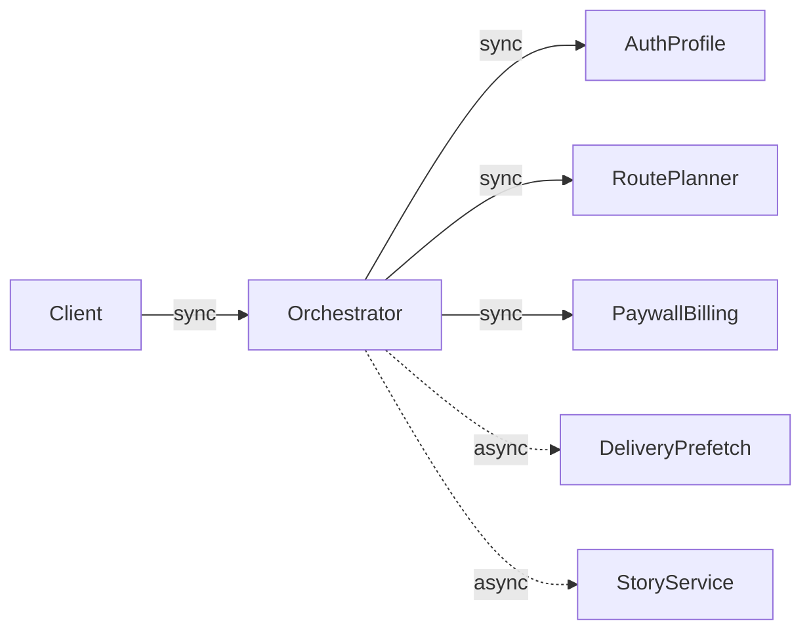
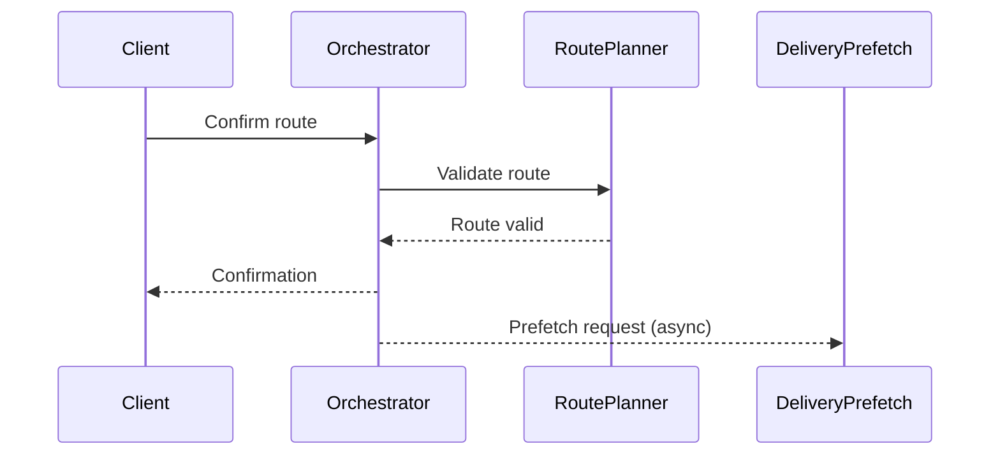

# Architecture Diagrams

## Service Map

```mermaid
graph LR
    Client -->|sync| Orchestrator
    Orchestrator -->|sync| AuthProfile
    Orchestrator -->|sync| RoutePlanner
    Orchestrator -->|sync| PaywallBilling
    Orchestrator -.->|async| DeliveryPrefetch
    Orchestrator -.->|async| StoryService
```

## Main Scenario: Route Confirmation to Prefetch

```mermaid
sequenceDiagram
    participant C as Client
    participant O as Orchestrator
    participant RP as RoutePlanner
    participant DP as DeliveryPrefetch

    C->>O: Confirm route
    O->>RP: Validate route
    RP-->>O: Route valid
    O-->>C: Confirmation
    O-->>DP: Prefetch request (async)
```

